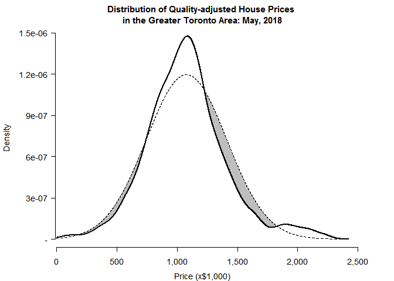
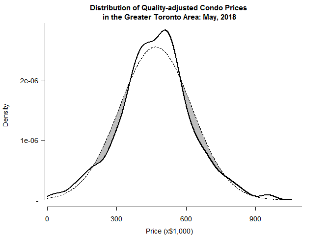

Detecting Housing Bubbles
================

``` r
#SCRAPE REAL-ESTATE LISTINGS DATA FROM WEB
ind <- 0
df <- data.frame(id=NA, flg=NA, type=NA, pr=NA, adr=NA, city=NA, hood=NA, bd=NA, ba=NA, sq=NA, age=NA)
for (n in 4:l(urls1)) { 
  urls2 <- paste0(urls1[n], typ) # <- Type
  
  for (i in 1:l(urls2)) {
    htm <- tryCatch( {rawToChar(getURLContent(urls2[i], useragent=ua, proxy=px))},
                     error=function(cond) {next} )    # <- Page num
    count <- as.numeric(gsub('^.*>\n<title>([0-9]+).*', '\\1', htm))
    if (is.na(count)) {
      next
    } else {
      pgs <- seq(1, ceiling(count/24))
      urls3 <- paste0(urls2[i],'/page-', pgs)
    }
    for (j in 1:l(urls3)) {
      cat('Copying from',urls3[j],' \n')
      htm <- getURL(urls3[j], useragent=ua, proxy=px)   # <- Pages
      htm <- gsub('"', '', htm)
      htm <- gsub('^.*<section id=gallery class(.*)$', '\\1', htm)
      htm <- gsub('^(.*)Showing results.*$', '\\1', htm)
      htm <- trimws(unlist(strsplit(htm, 'streetAddress>')))[-1]
      htm <- trimws(unlist(strsplit(htm, '<span class=address>')))
      
      flg <- rep(0, l(htm))
      flg <- ifelse(grepl('Ask us for address',htm), 1, flg)
      id <- gsub('^.*MLS: (.*) />\n.*$', '\\1', htm)
      type <- gsub('^.*alt=([[:alpha:]]+) for sale at.*$', '\\1', htm)
      adr <- gsub('^.*for sale at (.*) [[:alpha:]]+ Ontario.*$', '\\1', htm)
      
      city <- gsub('^.*for sale at .* ([[:alpha:]]+) Ontario.*$', '\\1', htm)
      hood <- gsub('^.*bull;</span>([^<]+)<.*$', '\\1', htm)
      hood <- ifelse(nchar(hood)>50, NA, hood)
      pr <- gsub('^.*price xs-inline xs-mr1>\\$([^<]+)<.*$', '\\1', htm)
      pr <- ifelse(nchar(pr)>12, 
                   gsub('^.*price xs-inline xs-mr1>[[:alpha:]]+? ?\\$([^<]+)<.*$', '\\1', htm), 
                   pr) 
      pr <- as.numeric(gsub('M','000000',gsub('K','000', gsub(',', '', pr))))
      bd <- as.numeric(gsub('^.*xs-mr1>([0-9]+) bd</li>.*$', '\\1', htm))
      ba <- as.numeric(gsub('^.*xs-mr1>([0-9]+) ba</li>.*$', '\\1', htm))
      sq <- round(rowMeans(cbind(
            as.numeric(gsub('^.*xs-mr1>([0-9]+)-.*$', '\\1\\2', htm)),
            as.numeric(gsub('^.*-([0-9]+) sqft</li>.*$', '\\1\\2', htm)))),-1)
      age <- gsub('^.*span>([^<]+)</span> Years.*','\\1', htm)
      age <- ifelse(nchar(age)>10, NA, age)
      
      df <- rbind(df, data.frame(id, flg, type, pr, adr, city, hood, bd, ba, sq, age, 
                                 stringsAsFactors=FALSE))
      ind <- ind + l(id)
      cat(ind,'records copied \n')
    }
  }
}
```

**Scraped Real Estate Data for the Greater Toronto Area**

    ##             id  type      pr                 adr    city bd ba   sq age
    ## 10240 E4121820 House  839900 74 Spring Forest Sq Toronto  4  4   NA  NA
    ## 10241 W4112067 House  899999     14 Bicknell Ave Toronto  3  3   NA  NA
    ## 10242 W4080239 House 2389000 61 Ridge Point Cres Toronto  4  7 4250 2.5
    ## 10243 E4124167 House 1100000 60 Marchington Circ Toronto  2  3   NA  NA
    ## 10244 E4124115 House  828800   55 Sandy Haven Dr Toronto  3  3   NA  NA
    ## 10245 W4124151 House  998000     68 Decarie Circ Toronto  3  2   NA  NA
    ##       Tor W E N NW
    ## 10240   1 0 0 0  0
    ## 10241   1 0 0 0  0
    ## 10242   1 0 0 0  0
    ## 10243   1 0 0 0  0
    ## 10244   1 0 0 0  0
    ## 10245   1 0 0 0  0

``` r
#HOUSING PRICE MODEL
adjust <- function(df) {
  df <- df[,c(3,6:14)]
  coeff <- lm(pr ~ bd + ba + sq + age + W + E + N + NW, data=df)[[1]]
  means <- apply(df, 2, FUN=function(v){mean(v, na.rm=TRUE)})
  
  bd.adj <- (means[2]-df$bd)*coeff[2]
  ba.adj <- (means[3]-df$ba)*coeff[3]
  sq.adj <- (means[4]-df$sq)*coeff[4]
  age.adj <- (means[5]-df$age)*coeff[5]
  W.adj <- (means[6]-df$W)*coeff[6]
  E.adj <- (means[7]-df$E)*coeff[7]
  N.adj <- (means[8]-df$N)*coeff[8]
  NW.adj <- (means[9]-df$NW)*coeff[9]

  pr.adj <- df$pr + bd.adj + ba.adj + sq.adj + age.adj + W.adj + E.adj + N.adj + NW.adj
  PR <- pr.adj[pr.adj > mean(pr.adj, na.rm=TRUE)-sd(pr.adj, na.rm=TRUE)*3 & 
               pr.adj < mean(pr.adj, na.rm=TRUE)+sd(pr.adj, na.rm=TRUE)*3]
  PR <- PR[PR>0 & PR<quantile(PR, 0.99, na.rm=TRUE)]
  return(PR[!is.na(PR)])
}

#DISTRIBUTION FUNCTION
densdist <- function(v, len=5000) {
  x.data <- density(v, n=len)$x
  y.data <- density(v, n=len)$y
  y.norm <- dnorm(x.data, mean=mean(v), sd=sd(v))
  df <- data.frame(x.data, y.data, y.norm)
  df <- df[df$x.data>0,]
  return(df)
}
```

**Quality-adjusted Prices**

    ##        x.data           y.data            y.norm
    ## 277  259.0981 0.00000001060608 0.000000006542215
    ## 278  771.7746 0.00000001070873 0.000000006574720
    ## 279 1284.4512 0.00000001081172 0.000000006607371
    ## 280 1797.1277 0.00000001091502 0.000000006640168
    ## 281 2309.8043 0.00000001101866 0.000000006673113
    ## 282 2822.4808 0.00000001112260 0.000000006706205




