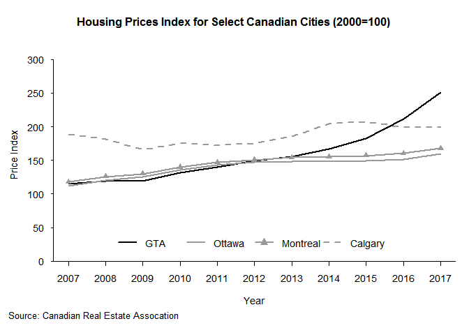
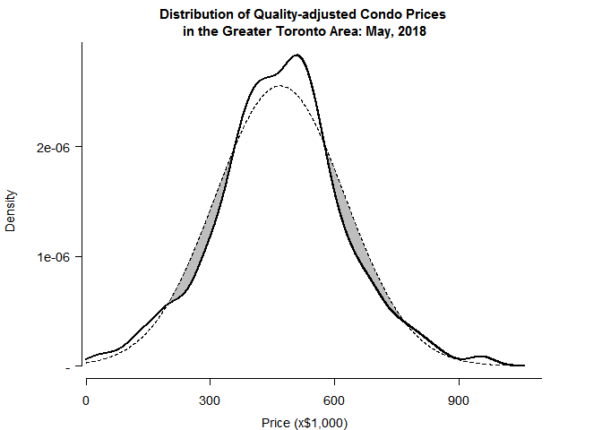

Detecting Housing Bubbles
================

**64 Per Cent Increase in House Prices From 2013 to 2017**

The average price of homes in the Greater Toronto Area has increased substantially in recent years, from about $465,000 in 2013 to about $761,000 in 2017 (64 per cent increase). Is there a housing 'bubble'?



Average prices trends alone are relatively crude and imprecise indicatord of housing bubbles. Average prices would not describe non-bubble scenarios, such as a price 'adjustment' due to an undervalued market prior to 2013.

A more robust approach would be to look at the entire cross-sectional price distribution and see whether it had fat upper (right) tail compared to a normal distribution. The insight gained would be useful to prospective home buyers and real-estate developers.

**Code for Scraping Real-Estate Listings Data**

The proposed Toronto study would source data online by scraping a widely used real estate listing website. While there are many such listing services, presumably their content is similar, given that they generally subscribe to the same 'Multiple Listing Service' database.

``` r
ind <- 0
df <- data.frame(id=NA, flg=NA, type=NA, pr=NA, adr=NA, city=NA, hood=NA, bd=NA, ba=NA, sq=NA, age=NA)
for (n in 4:l(urls1)) { 
  urls2 <- paste0(urls1[n], typ) # <- Type
  
  for (i in 1:l(urls2)) {
    htm <- tryCatch( {rawToChar(getURLContent(urls2[i], useragent=ua, proxy=px))},
                     error=function(cond) {next} )    # <- Page num
    count <- as.numeric(gsub('^.*>\n<title>([0-9]+).*', '\\1', htm))
    if (is.na(count)) {
      next
    } else {
      pgs <- seq(1, ceiling(count/24))
      urls3 <- paste0(urls2[i],'/page-', pgs)
    }
    for (j in 1:l(urls3)) {
      cat('Copying from',urls3[j],' \n')
      htm <- getURL(urls3[j], useragent=ua, proxy=px)   # <- Pages
      htm <- gsub('"', '', htm)
      htm <- gsub('^.*<section id=gallery class(.*)$', '\\1', htm)
      htm <- gsub('^(.*)Showing results.*$', '\\1', htm)
      htm <- trimws(unlist(strsplit(htm, 'streetAddress>')))[-1]
      htm <- trimws(unlist(strsplit(htm, '<span class=address>')))
      
      flg <- rep(0, l(htm))
      flg <- ifelse(grepl('Ask us for address',htm), 1, flg)
      id <- gsub('^.*MLS: (.*) />\n.*$', '\\1', htm)
      type <- gsub('^.*alt=([[:alpha:]]+) for sale at.*$', '\\1', htm)
      adr <- gsub('^.*for sale at (.*) [[:alpha:]]+ Ontario.*$', '\\1', htm)
      
      city <- gsub('^.*for sale at .* ([[:alpha:]]+) Ontario.*$', '\\1', htm)
      hood <- gsub('^.*bull;</span>([^<]+)<.*$', '\\1', htm)
      hood <- ifelse(nchar(hood)>50, NA, hood)
      pr <- gsub('^.*price xs-inline xs-mr1>\\$([^<]+)<.*$', '\\1', htm)
      pr <- ifelse(nchar(pr)>12, 
                   gsub('^.*price xs-inline xs-mr1>[[:alpha:]]+? ?\\$([^<]+)<.*$', '\\1', htm), 
                   pr) 
      pr <- as.numeric(gsub('M','000000',gsub('K','000', gsub(',', '', pr))))
      bd <- as.numeric(gsub('^.*xs-mr1>([0-9]+) bd</li>.*$', '\\1', htm))
      ba <- as.numeric(gsub('^.*xs-mr1>([0-9]+) ba</li>.*$', '\\1', htm))
      sq <- round(rowMeans(cbind(
            as.numeric(gsub('^.*xs-mr1>([0-9]+)-.*$', '\\1\\2', htm)),
            as.numeric(gsub('^.*-([0-9]+) sqft</li>.*$', '\\1\\2', htm)))),-1)
      age <- gsub('^.*span>([^<]+)</span> Years.*','\\1', htm)
      age <- ifelse(nchar(age)>10, NA, age)
      
      df <- rbind(df, data.frame(id, flg, type, pr, adr, city, hood, bd, ba, sq, age, 
                                 stringsAsFactors=FALSE))
      ind <- ind + l(id)
      cat(ind,'records copied \n')
    }
  }
}
```

**Sample of Scraped Real-Estate Data**

<table>
<thead>
<tr>
<th style="text-align:left;">
</th>
<th style="text-align:left;">
type
</th>
<th style="text-align:right;">
pr
</th>
<th style="text-align:left;">
adr
</th>
<th style="text-align:left;">
city
</th>
<th style="text-align:right;">
bd
</th>
<th style="text-align:right;">
ba
</th>
<th style="text-align:right;">
sq
</th>
<th style="text-align:right;">
age
</th>
<th style="text-align:right;">
Tor
</th>
<th style="text-align:right;">
W
</th>
<th style="text-align:right;">
E
</th>
<th style="text-align:right;">
N
</th>
<th style="text-align:right;">
NW
</th>
</tr>
</thead>
<tbody>
<tr>
<td style="text-align:left;">
10240
</td>
<td style="text-align:left;">
House
</td>
<td style="text-align:right;">
839900
</td>
<td style="text-align:left;">
74 Spring Forest Sq
</td>
<td style="text-align:left;">
Toronto
</td>
<td style="text-align:right;">
4
</td>
<td style="text-align:right;">
4
</td>
<td style="text-align:right;">
NA
</td>
<td style="text-align:right;">
NA
</td>
<td style="text-align:right;">
1
</td>
<td style="text-align:right;">
0
</td>
<td style="text-align:right;">
0
</td>
<td style="text-align:right;">
0
</td>
<td style="text-align:right;">
0
</td>
</tr>
<tr>
<td style="text-align:left;">
10241
</td>
<td style="text-align:left;">
House
</td>
<td style="text-align:right;">
899999
</td>
<td style="text-align:left;">
14 Bicknell Ave
</td>
<td style="text-align:left;">
Toronto
</td>
<td style="text-align:right;">
3
</td>
<td style="text-align:right;">
3
</td>
<td style="text-align:right;">
NA
</td>
<td style="text-align:right;">
NA
</td>
<td style="text-align:right;">
1
</td>
<td style="text-align:right;">
0
</td>
<td style="text-align:right;">
0
</td>
<td style="text-align:right;">
0
</td>
<td style="text-align:right;">
0
</td>
</tr>
<tr>
<td style="text-align:left;">
10242
</td>
<td style="text-align:left;">
House
</td>
<td style="text-align:right;">
2389000
</td>
<td style="text-align:left;">
61 Ridge Point Cres
</td>
<td style="text-align:left;">
Toronto
</td>
<td style="text-align:right;">
4
</td>
<td style="text-align:right;">
7
</td>
<td style="text-align:right;">
4250
</td>
<td style="text-align:right;">
2.5
</td>
<td style="text-align:right;">
1
</td>
<td style="text-align:right;">
0
</td>
<td style="text-align:right;">
0
</td>
<td style="text-align:right;">
0
</td>
<td style="text-align:right;">
0
</td>
</tr>
<tr>
<td style="text-align:left;">
10243
</td>
<td style="text-align:left;">
House
</td>
<td style="text-align:right;">
1100000
</td>
<td style="text-align:left;">
60 Marchington Circ
</td>
<td style="text-align:left;">
Toronto
</td>
<td style="text-align:right;">
2
</td>
<td style="text-align:right;">
3
</td>
<td style="text-align:right;">
NA
</td>
<td style="text-align:right;">
NA
</td>
<td style="text-align:right;">
1
</td>
<td style="text-align:right;">
0
</td>
<td style="text-align:right;">
0
</td>
<td style="text-align:right;">
0
</td>
<td style="text-align:right;">
0
</td>
</tr>
<tr>
<td style="text-align:left;">
10244
</td>
<td style="text-align:left;">
House
</td>
<td style="text-align:right;">
828800
</td>
<td style="text-align:left;">
55 Sandy Haven Dr
</td>
<td style="text-align:left;">
Toronto
</td>
<td style="text-align:right;">
3
</td>
<td style="text-align:right;">
3
</td>
<td style="text-align:right;">
NA
</td>
<td style="text-align:right;">
NA
</td>
<td style="text-align:right;">
1
</td>
<td style="text-align:right;">
0
</td>
<td style="text-align:right;">
0
</td>
<td style="text-align:right;">
0
</td>
<td style="text-align:right;">
0
</td>
</tr>
<tr>
<td style="text-align:left;">
10245
</td>
<td style="text-align:left;">
House
</td>
<td style="text-align:right;">
998000
</td>
<td style="text-align:left;">
68 Decarie Circ
</td>
<td style="text-align:left;">
Toronto
</td>
<td style="text-align:right;">
3
</td>
<td style="text-align:right;">
2
</td>
<td style="text-align:right;">
NA
</td>
<td style="text-align:right;">
NA
</td>
<td style="text-align:right;">
1
</td>
<td style="text-align:right;">
0
</td>
<td style="text-align:right;">
0
</td>
<td style="text-align:right;">
0
</td>
<td style="text-align:right;">
0
</td>
</tr>
</tbody>
</table>
**House Price Prediction/Adjustment Model**

House prices were adjusted for quality (their features) to control for exogenous characteristics affecting individual house prices, such as their size (sqft), the number of bedrooms, the number of bathrooms, and their location with respect to Metropolitan Toronto.

``` r
adjust <- function(df) {
  df <- df[,c(3,6:14)]
  coeff <- lm(pr ~ bd + ba + sq + age + W + E + N + NW, data=df)[[1]]
  means <- apply(df, 2, FUN=function(v){mean(v, na.rm=TRUE)})
  
  bd.adj <- (means[2]-df$bd)*coeff[2]
  ba.adj <- (means[3]-df$ba)*coeff[3]
  sq.adj <- (means[4]-df$sq)*coeff[4]
  age.adj <- (means[5]-df$age)*coeff[5]
  W.adj <- (means[6]-df$W)*coeff[6]
  E.adj <- (means[7]-df$E)*coeff[7]
  N.adj <- (means[8]-df$N)*coeff[8]
  NW.adj <- (means[9]-df$NW)*coeff[9]

  pr.adj <- df$pr + bd.adj + ba.adj + sq.adj + age.adj + W.adj + E.adj + N.adj + NW.adj
  PR <- pr.adj[pr.adj > mean(pr.adj, na.rm=TRUE)-sd(pr.adj, na.rm=TRUE)*3 & 
               pr.adj < mean(pr.adj, na.rm=TRUE)+sd(pr.adj, na.rm=TRUE)*3]
  PR <- PR[PR>0 & PR<quantile(PR, 0.99, na.rm=TRUE)]
  return(PR[!is.na(PR)])
}

#DISTRIBUTION FUNCTION
densdist <- function(v, len=5000) {
  x.data <- density(v, n=len)$x
  y.data <- density(v, n=len)$y
  y.norm <- dnorm(x.data, mean=mean(v), sd=sd(v))
  df <- data.frame(x.data, y.data, y.norm)
  df <- df[df$x.data>0,]
  return(df)
}
```

**Density Distribution of Quality-adjusted Home Prices**

Initial analysis shows that Toronto likely is not experiencing a housing price bubble, as adjusted prices for both houses and condos (solid lines) are not skewed to the right. In fact, they appear slightly skewed to the left compared to the normal distribution (dotted line). This suggests that the market is currently undervalued and that prices may continue to rise indefinitely



